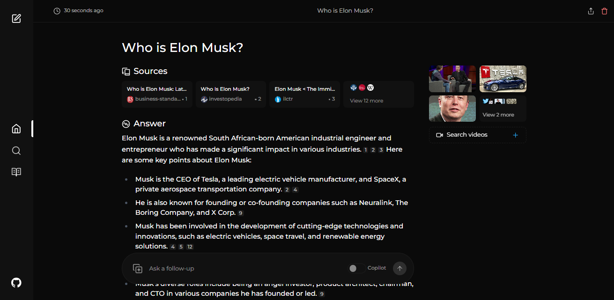

# 🚀 Starknet Agent - An AI-powered search engine for the Starknet Ecosystem 🔎 <!-- omit in toc -->



## Table of Contents <!-- omit in toc -->

- [Overview](#overview)
- [Preview](#preview)
- [Features](#features)
- [Installation](#installation)
  - [Getting Started with Docker (Recommended)](#getting-started-with-docker-recommended)
  - [Non-Docker Installation](#non-docker-installation)
  - [Ollama Connection Errors](#ollama-connection-errors)
- [Using as a Search Engine](#using-as-a-search-engine)
- [One-Click Deployment](#one-click-deployment)
- [Upcoming Features](#upcoming-features)
- [Support Us](#support-us)
  - [Donations](#donations)
- [Contribution](#contribution)
- [Help and Support](#help-and-support)

## Credits

This project was originally forked from [Perplexica](https://github.com/ItzCrazyKns/Perplexica), an open-source AI search engine. We've adapted and expanded upon their work to create a specialized tool for the Starknet ecosystem. We're grateful for their initial contribution which provided a base foundation for Starknet Agent.

## Overview

Starknet Agent is an open-source AI-powered searching tool specifically designed for the Starknet Ecosystem. It uses advanced machine learning algorithms to search and understand the Starknet documentation and the Cairo Book, providing clear and accurate answers to your queries about Starknet and Cairo.

## Preview


## Features

- **Local LLMs**: You can make use of local LLMs such as Llama3 and Mixtral using Ollama.
- **Focus Modes:** Special modes to better answer specific types of questions. Starknet Agent currently has 3 focus modes:
  - **Starknet Ecosystem:** Searches the entire Starknet Ecosystem, including the [Cairo Book](https://book.cairo-lang.org) and the [Starknet documentation](https://docs.starknet.io).
  - **Cairo Book:** Searches the [Cairo Book](https://book.cairo-lang.org) for answers.
  - **Starknet Docs:** Searches the [Starknet documentation](https://docs.starknet.io) for answers.

## Installation

There are mainly 2 ways of installing Starknet Agent - With Docker, Without Docker. Using Docker is highly recommended.

### Getting Started with Docker (Recommended)

1. Ensure Docker is installed and running on your system.
2. Clone the Starknet Agent repository:

   ```bash
   git clone https://github.com/cairo-book/starknet-agent.git
   ```

3. After cloning, navigate to the directory containing the project files.

4. Rename the `sample.config.toml` file to `config.toml`. For Docker setups, you need only fill in the following fields:

   - `OPENAI`: Your OpenAI API key. **You only need to fill this if you wish to use OpenAI's models**.
   - `OLLAMA`: Your Ollama API URL. You should enter it as `http://host.docker.internal:PORT_NUMBER`. If you installed Ollama on port 11434, use `http://host.docker.internal:11434`. For other ports, adjust accordingly. **You need to fill this if you wish to use Ollama's models instead of OpenAI's**.
   - `GROQ`: Your Groq API key. **You only need to fill this if you wish to use Groq's hosted models**.
   - `ANTHROPIC`: Your Anthropic API key. **You only need to fill this if you wish to use Anthropic models**.

     **Note**: You can change these after starting Starknet Agent from the settings dialog.

   - `SIMILARITY_MEASURE`: The similarity measure to use (This is filled by default; you can leave it as is if you are unsure about it.)
   - CAIRO_DB and STARKNET_DB: These are the databases for the Cairo Book and Starknet Documentation. You will need to fill these with your own database URLs.

5. Ensure you are in the directory containing the `docker-compose.yaml` file and execute:

   ```bash
   docker compose up -d
   ```

5bis. Alternatively, you can start the containers in dev mode, with hot reloading, by running:

```bash
docker compose up -f docker-compose.dev.yaml up -d
```

6. Wait a few minutes for the setup to complete. You can access Starknet Agent at http://localhost:3000 in your web browser.

**Note**: After the containers are built, you can start Starknet Agent directly from Docker without having to open a terminal.

### Non-Docker Installation

1. Install SearXNG and allow `JSON` format in the SearXNG settings.
2. Clone the repository and rename the `sample.config.toml` file to `config.toml` in the root directory. Ensure you complete all required fields in this file.
3. Rename the `.env.example` file to `.env` in the `ui` folder and fill in all necessary fields.
4. After populating the configuration and environment files, run `npm i` in both the `ui` folder and the root directory.
5. Install the dependencies and then execute `npm run build` in both the `ui` folder and the root directory.
6. Finally, start both the frontend and the backend by running `npm run start` in both the `ui` folder and the root directory.

**Note**: Using Docker is recommended as it simplifies the setup process, especially for managing environment variables and dependencies.

### Ollama Connection Errors

If you're encountering an Ollama connection error, it is likely due to the backend being unable to connect to Ollama's API. To fix this issue you can:

1. **Check your Ollama API URL:** Ensure that the API URL is correctly set in the settings menu.
2. **Update API URL Based on OS:**

   - **Windows:** Use `http://host.docker.internal:11434`
   - **Mac:** Use `http://host.docker.internal:11434`
   - **Linux:** Use `http://<private_ip_of_host>:11434`

   Adjust the port number if you're using a different one.

3. **Linux Users - Expose Ollama to Network:**

   - Inside `/etc/systemd/system/ollama.service`, you need to add `Environment="OLLAMA_HOST=0.0.0.0"`. Then restart Ollama by `systemctl restart ollama`. For more information see [Ollama docs](https://github.com/ollama/ollama/blob/main/docs/faq.md#setting-environment-variables-on-linux)

   - Ensure that the port (default is 11434) is not blocked by your firewall.

## Upcoming Features

- [x] Add settings page
- [x] Adding support for local LLMs
- [x] History Saving features
- [ ] Expanding coverage of Starknet-related resources
- [ ] Adding an Autonomous Agent Mode for more precise answers

## Contribution

For more information on contributing to Starknet Agent you can read the [CONTRIBUTING.md](CONTRIBUTING.md) file to learn more about Starknet Agent and how you can contribute to it.
